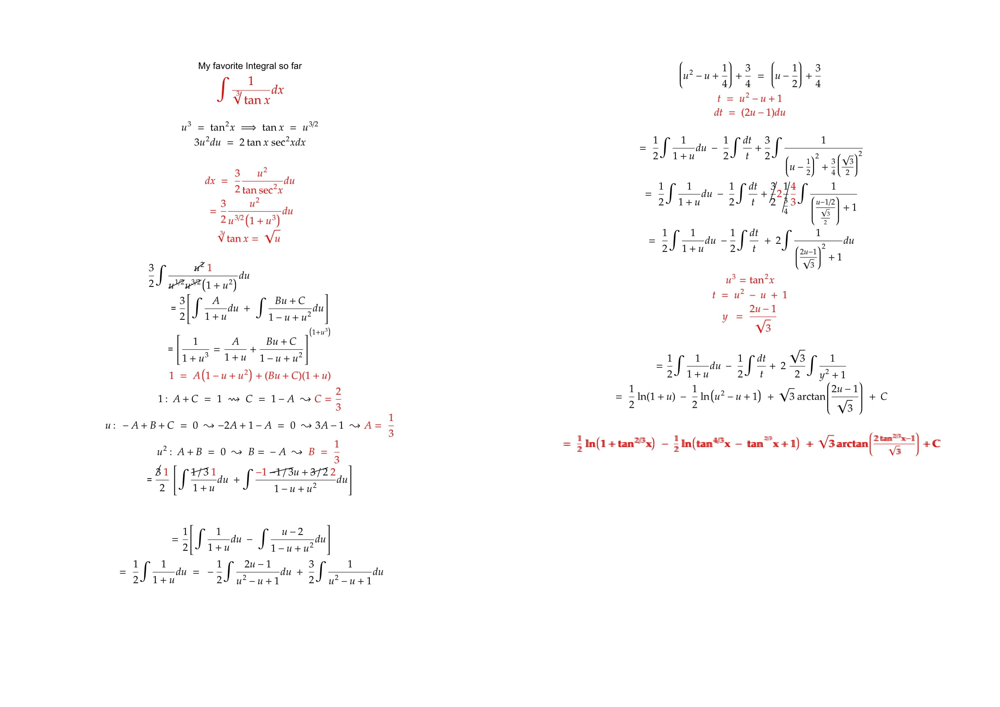

<h1 align="center">  , I'm 0xffset</h1>
<p align="center">
<h3 align="center">Software Developer | Data Scientist | Linux | Quantum Computing | Mathematics | Electronics</h3>
</p>
<p align="center">
<a href="https://www.linkedin.com/in/rogger-garc%C3%ADa-d%C3%ADaz-5100a41b1/" target="blank"></a>
	<a href = "mailto: roggergarciadiaz@gmail.com"></a>
</p>
<p align="center">
  <em>
  24y/o Software Developer and Data Scientist with interests in fields like Cybersecurity, Quantum Computing, and Mathematics.
  </em> 
  <br>
</p>


  ```perl
// Fermat's last problem x^n+y^n=z^n
#!/usr/bin/perl
use strict;
use warnings;

sub fermat {
	my ($n) = @_;
	for (my $x = 0; $x < 100; $x++) {
		for (my $y = 0; $y < $x+1; $y++) {
			for (my $z = 0; $z < ($x**$n)+($y**$n) +1; $z++) {
				if (($x**$n)+($y**$n) == ($z**$n)) {
					print "$x^$n + $y^$n == $z^$n\n";		
					}
				}
			} 
	}


my $e = fermat(5);


```
- 🔭 Bachelor's degree in **Computer Science**
- 🌱 I’m currently learning **Computational Methods** 
- ⚙️ Mastering: `.py`, `.cpp`, `.c`, `.perl`, `.java`, `.html`, `.css`  `.s`, `.sh`, `.go`, `.rs`, `.sql`, `.sh`

<h2 align="center"></h2>
<p align="center"></p>
<p></p>
<a href=""></a>


------------
# Random Erdős Problem

Problem #31

Given any infinite set $A\subset \mathbb{N}$ there is a set $B$ of density $0$ such that $A+B$ contains all except finitely many integers.

Conjectured by Erd\H{o}s and Straus. Proved by Lorentz \cite{Lo54}.


---

🔗 Source: https://www.erdosproblems.com/latex/31

_Last updated: 2026-06-08T19:01:35.880Z_


<a align="center"></p>


## Here's my favorite math stuff so far...

<details>
  <summary>My favorite integral so far</summary>
  <ol>
    <li>
     
    </li>
  </ol>
</details>