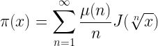

<h1 align="center"> Hello , I'm rolEYder</h1>
<p align="center">
<h3 align="center">Computer Student Student | Linux | Quantum Computing | Mathematics</h3>
</p>
<p align="center">
<a href="https://www.linkedin.com/in/rogger-garc%C3%ADa-d%C3%ADaz-5100a41b1/" target="blank"></a>
	<a href = "mailto: roggergarciadiaz@gmail.com"></a>
</p>
<p align="center">
  <em>
  20y/o Computer science student with interests in branches like Cybersecurity, Quantum Computing, and Mathematics
  </em> 
  <br>
</p>


  ```perl
// Fermat's last problem x^n+y^n=z^n
#!/usr/bin/perl
use strict;
use warnings;

sub fermat {
	my ($n) = @_;
	for (my $x = 0; $x < 100; $x++) {
		for (my $y = 0; $y < $x+1; $y++) {
			for (my $z = 0; $z < ($x**$n)+($y**$n) +1; $z++) {
				if (($x**$n)+($y**$n) == ($z**$n)) {
					print "$x^$n + $y^$n == $z^$n\n";		
					}
				}
			} 
	}


my $e = fermat(5);


```
- 🔭 Bachelor's degree in **Computer Science**  and **Mathematics**
- 🌱 I’m currently learning **Linear Algebra** 
- 🌱 I’m currently learning **Mathematical Logic** and **Computational Geometry**
- ⚙️ Mastering: `.py`, `.cpp`, `.c`, `.perl`, `.java`, `.html`, `.css`  `.s`, `.sh`, `.go`

<h2 align="center">The Explicit Formula for the Prime Counting Function</h2>
<p align="center"></p>
<p>Here is the significance of this equation, in English:

        Prime numbers are numbers that have no divisors other than 1 and themselves. The primes below 100 are 2, 3, 5, 7, 11, 13, 17, 19, 23, 29, 31, 37, 41, 43, 47, 53, 59, 61, 67, 71, 73, 79, 83, 89, 97. From this, it is already clear that there is no apparent pattern to the primes: in some runs of numbers you will get a lot of primes, in other runs you will find no primes, and whether a run has a lot of primes or no primes seems to be totally at random.
        
        For a very long time, mathematicians have been trying to find a pattern to the prime numbers. The equation above is an explicit function for the number of primes less than or equal to a given number.</p>
> <a href="https://nargaque.com/2011/10/05/10-mind-blowing-mathematical-equations/">The Explicit Formula for the Prime Counting Function</a>


------------
> If you can&#39;t explain it simply, you don&#39;t understand it well enough.
>
> *Albert Einstein*

<a align="center"></p>


## Here's my favorite math stuff so far...

<details>
  <summary>My favorite integral so far</summary>
  <ol>
    <li>
     
    </li>
  </ol>
</details>