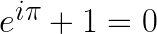

<h1 align="center"> Hola , I'm 0xffset</h1>
<p align="center">
<h3 align="center">Computer Student Student | Linux | Quantum Computing | Mathematics</h3>
</p>
<p align="center">
<a href="https://www.linkedin.com/in/rogger-garc%C3%ADa-d%C3%ADaz-5100a41b1/" target="blank"></a>
	<a href = "mailto: roggergarciadiaz@gmail.com"></a>
</p>
<p align="center">
  <em>
  21y/o Computer science student with interests in fields like Cybersecurity, Quantum Computing, and Mathematics.
  </em> 
  <br>
</p>


  ```perl
// Fermat's last problem x^n+y^n=z^n
#!/usr/bin/perl
use strict;
use warnings;

sub fermat {
	my ($n) = @_;
	for (my $x = 0; $x < 100; $x++) {
		for (my $y = 0; $y < $x+1; $y++) {
			for (my $z = 0; $z < ($x**$n)+($y**$n) +1; $z++) {
				if (($x**$n)+($y**$n) == ($z**$n)) {
					print "$x^$n + $y^$n == $z^$n\n";		
					}
				}
			} 
	}


my $e = fermat(5);


```
- 🔭 Bachelor's degree in **Computer Science**  and **Mathematics**
- 🌱 I’m currently learning **Number Theory** 
- ⚙️ Mastering: `.py`, `.cpp`, `.c`, `.perl`, `.java`, `.html`, `.css`  `.s`, `.sh`, `.go`

<h2 align="center">Euler’s Identity</h2>
<p align="center"></p>
<p>A very famous equation, Euler’s identity relates the seemingly random 
        values of pi, e, and the square root of -1. It is considered by many to be the most beautiful equation in mathematics. A more general formula is e^(ix) = cos(x)+isin(x)
        When x = π , the value of cos x is -1, while isin x is 0, resulting in Euler’s identity, as -1 + 1 = 0. </p>
> <a href="https://nargaque.com/2011/10/05/10-mind-blowing-mathematical-equations/">Euler’s Identity</a>


------------
> If you can&#39;t explain it simply, you don&#39;t understand it well enough.
>
> *Albert Einstein*

<a align="center"></p>


## Here's my favorite math stuff so far...

<details>
  <summary>My favorite integral so far</summary>
  <ol>
    <li>
     
    </li>
  </ol>
</details>